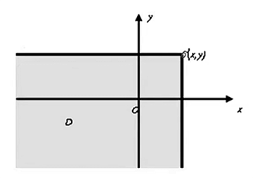

# 第三章 多维随机变量及其分布概率

## 第一节 多维随机变量的概念

### 1.二维随机变量及其分布函数

#### 二维随机变量

设 `X = X(ω), Y = Y(ω)` 是定义在空间 `Ω = {ω}` 的两个随机变量，则称 `(X,Y)` 为二维随机变量

#### 联合分布函数

设 `(X,Y)` 为一个二维随机变量

```
F(x,y) = P{X ≤ x, Y ≤ y}

(-∞ < x < +∞, -∞ < y < +∞)
```

称二元函数 `F(x,y)` 为 `X` 与 `Y` 的联合分布函数，简称 `(X,Y)` 的分布函数，本质就是概率

- 一维连续型随机变量 `X` 的可能取值为某个或某些区间，甚至整个数轴
- 二维随机变量 `(X,Y)` 的可能取值范围则为 `XOY` 平面上的某个或某些区域，甚至为某个平面



#### 例题 1：二维随机变量 (X,Y) 的分布函数为 F(x,y)，则 F(+∞,+∞) = ?

全覆盖面，等于 1

#### 例题 2：二维随机变量 (X,Y) 的分布函数为 F(x,y)，则 P{X ≤0, Y ≤ 0} 表示为？

F(0, 0)

#### 边缘分布函数

`(X,Y)` 的两个分量与各自的分布函数分别称为二维随机变量 `(X,Y)` 关于 `X` 与关于 `Y` 的边缘分布函数 `Fₓ(x)` 和 `Fᵧ(y)`

边缘分布函数可由联合分布函数确定：

```
// X 边缘：Y 取所有
Fₓ(x) = P{X ≤ x} = P{X ≤ x, Y < +∞} = F(x, +∞)

// Y 边缘：X 取所有
Fᵧ(y) = P{Y ≤ y} = P{X < +∞, Y ≤ y} = F(+∞, y)
```

#### 例题：已知二维随机变量 (X,Y) 的分布函数 F(x,y)，求 P{x₁ < X ≤ x₂, y₁ < Y ≤ y₂}


```
F(x₂y₂) - F(x₁y₂) - F(x₂y₁) + F(x₁y₁)
```

### 2.二维离散型随机变量的分布律和边缘分布律

定义：`(X,Y)` 的取值为有限对或无穷可列对，称 `(X,Y)` 为二维离散型随机变量

`(X,Y)` 的分布律性质：

1. `0 ≤ Pᵢⱼ ≤ 1 (i,j = 1, 2, ...)`
2. `ΣᵢΣⱼPᵢⱼ = 1`

若数集 `{pᵢⱼ} (i,j = 1, 2, ...)` 具有以上两条性质，则它必可作为某二维离散型随机变量的分布律

> X,Y 二维表之和为 1

#### 例题：根据二维随机变量分布律

| X\Y | 0 | 1 | 2 |
| :--: | :--: | :--: | :--: |
| 1 | 0.1 | 0.2 | 0.25 |
| 2 | 0 | 0.15 | A |

1. `A` 值 = 1 - 其它之和 = 0.3
2. `P{X = Y}` = 0.2 + 0.3 = 0.5
3. `P{X + Y ≤ 2}` = 0.1 + 0.2 + 0 = 0.3
4. `P{X = 1}` = 0.1 + 0.2 + 0.25 = 0.55

5. 求 `X,Y` 的边缘分布

补全表格可得：

| X | 1 | 2 |
| :--: | :--: | :--: |
| P | 0.55 | 0.45 |

| Y | 0 | 1 | 2 |
| :--: | :--: | :--: | :--: |
| P | 0.1 | 0.35 | 0.55 |

### 3.二维连续型随机变量的概率密度和边缘概率密度

定义：`(X,Y)` 的取值为无限多个，称 `(X,Y)` 为二维连续型随机变量

概率密度函数 `f(x,y)` 的性质：

1. `f(x,y) ≥ 0`

2.  （双重积分 1 为体积）

若 `f(x,y)` 在 `(x,y)` 处连续，则有：


---

设 `D` 为平面上有界区域，其面积为 `S > 0`，如果二维随机变量 `(X,Y)` 的概率密度为：

```
f(x,y) = {
  1/S, (x,y) ∈ D,
  0, 其它.
```

- S: 面积
- D: 形状

则称 `(X,Y)` 服从区域 D 上的均匀分布 `(X,Y)~U_D`

#### 例题 1：根据二维随机变量 (X,Y) 的概率密度，求 P{0 ≤ X ≤ 1, 0 ≤ Y ≤ 1}

```
f(x,y) = {
  1/4, -1 ≤ x ≤ 1, -1 ≤ y ≤ 1,
  0, 其它.
```

```
一个底面积为 2*2，高为 1/4 的正方体（体积 1）
现在缩小到原有 1/4
1 * 1/4 = 1/4
```

#### 例题 2：设二维随机变量 (X,Y) 服从区域 D: 1- ≤ x ≤ 2, 0 ≤ y ≤ 2 上的均匀分布，则 (X,Y) 的概率密度函数 f(x,y)

1. 在 `D` 上的表达式

1/6

2. 密度函数表达式

```
f(x,y) = {
  1/6, -1 ≤ x ≤ 2, 0 ≤ y ≤ 2,
  0, 其它.
```

## 第二节 随机变量的独立性

### 1.两个随机变量的独立性

对任意实数 `x,y` 都有 `F(x,y) = Fₓ(x)·Fᵧ(y)`，则称随机变量 `X,Y` 独立

> 联合 = 边缘 × 边缘 （仅在独立条件下可用）

```
P{X ≤ x, Y ≤ y} = P{X ≤ x}·P{Y ≤ y}
```

### 2.二维离散型随机变量的独立性

```
P{X = xᵢ,Y = yⱼ} = P{X = xᵢ}·P{Y = yⱼ}
```

#### 例题 1：二维随机变量 X,Y 相互独立，且服从参数为 1 的泊松分布，求 P{X = 1,Y = 2}

```
= P{X = 1} · P{Y = 2}
= (1¹e⁻¹/1)(1²e⁻¹/2)
= e⁻¹ × e⁻¹ / 2
= e⁻²/2
```

#### 例题 2：X,Y 相互独立，根据分布律求 a,b

| X\Y | 1 | 2 |
| :--: | :--: | :--: |
| 1 | 1/9 | a |
| 2 | 1/6 | 1/3 |
| 3 | 1/18 | b |

```
补全表格边缘
```

| X\Y | 1 | 2 | |
| :--: | :--: | :--: | :--: |
| 1 | 1/9 | a | 1/9 + a |
| 2 | 1/6 | 1/3 | |
| 3 | 1/18 | b | 1/18 + b |
| | 1/3 | | |

```
因为独立，则有 P{X = 1, Y = 1} = P{X = 1}·P{Y = 1}
1/9 = (1/9 + a)(1/3)
a = 1/9

1/18 = (1/18 + b)(1/3)
// 或
b = 1 - 其它之和
```

### 3.二维连续型随机变量的独立性

### 4.n 个随机变量的相互独立

## 第三节 两个随机变量的函数的分布

### 1.两个离散型随机变量的函数的分布

### 2.两个独立连续型随机变量之和的概率分布

## 总览


