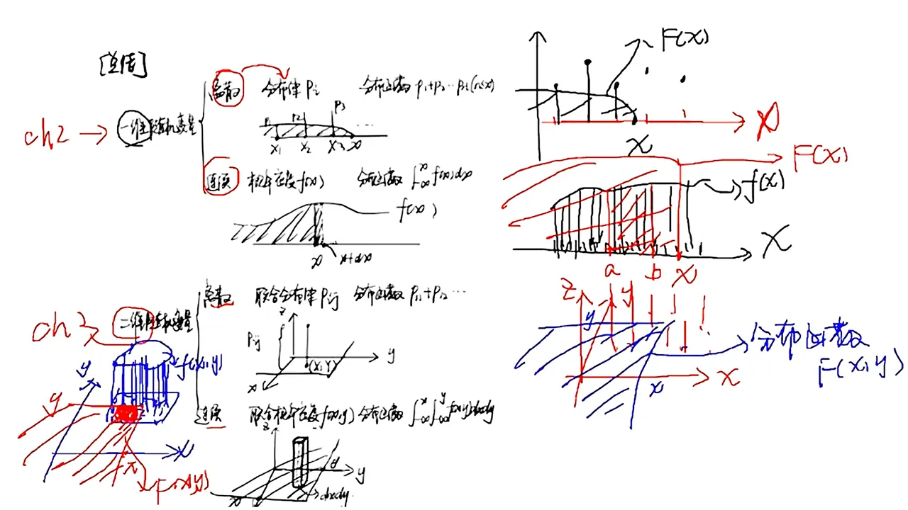

# 第三章 多维随机变量及其分布概率

## 第一节 多维 r.v. 的概念

### 1.二维 r.v. 及其分布函数

#### 二维 r.v.

设 `X = X(ω), Y = Y(ω)` 是定义在空间 `Ω = {ω}` 的两个 r.v.，则称 `(X,Y)` 为二维 r.v.

#### 联合分布函数

设 `(X,Y)` 为一个二维 r.v.

```
F(x,y) = P{X ≤ x, Y ≤ y}

(-∞ < x < +∞, -∞ < y < +∞)
```

称二元函数 `F(x,y)` 为 `X` 与 `Y` 的联合分布函数，简称 `(X,Y)` 的分布函数，本质就是概率

- 一维连续型 r.v. `X` 的可能取值为某个或某些区间，甚至整个数轴
- 二维 r.v. `(X,Y)` 的可能取值范围则为 `X0Y` 平面上的某个或某些区域，甚至为某个平面


> [例题 1~2](./03.第三章例题.md#例题-1二维-rv-xy-的分布函数为-fxy则-f--)

#### 边缘分布函数

`(X,Y)` 的两个分量与各自的分布函数分别称为二维 r.v. `(X,Y)` 关于 `X` 与关于 `Y` 的边缘分布函数 `Fₓ(x)` 和 `Fᵧ(y)`

边缘分布函数可由联合分布函数确定：

```
// X 边缘：Y 取所有
Fₓ(x) = P{X ≤ x} = P{X ≤ x, Y < +∞} = F(x, +∞)

// Y 边缘：X 取所有
Fᵧ(y) = P{Y ≤ y} = P{X < +∞, Y ≤ y} = F(+∞, y)
```

> [例题 3](./03.第三章例题.md#例题-3已知二维-rv-xy-的分布函数-fxy求-px--x--x-y--y--y)

### 2.二维离散型 r.v. 的分布律和边缘分布律

`(X,Y)` 的取值为有限对或无穷可列对，称 `(X,Y)` 为二维**离散型** r.v.

`(X,Y)` 的分布律性质：

1. `0 ≤ Pᵢⱼ ≤ 1 (i,j = 1, 2, ...)`
2. `ΣᵢΣⱼPᵢⱼ = 1`

若数集 `{pᵢⱼ} (i,j = 1, 2, ...)` 具有以上两条性质，则它必可作为某二维离散型 r.v. 的分布律

> X,Y 二维表之和为 1

边缘分布律：对于二维离散型 r.v. `(X,Y)`，其分量 `X` 与 `Y` 各自的分布律分别称为 `(X,Y)` 关于 `X` 与关于 `Y` 的边缘分布律，记为 `pᵢ,i=1,2,...` 和 `pⱼ,j=1,2,...`

> [例题 4](./03.第三章例题.md#例题-4根据二维-rv-分布律)

### 3.二维连续型 r.v. 的概率密度和边缘概率密度

`(X,Y)` 的取值为无限多个，称 `(X,Y)` 为二维**连续型** r.v.

概率密度函数 `f(x,y)` 的性质：

1. `f(x,y) ≥ 0`

2.  （双重积分 1 为体积）

若 `f(x,y)` 在 `(x,y)` 处连续，则有：


---

设 `D` 为平面上有界区域，其面积为 `S > 0`，如果二维 r.v. `(X,Y)` 的概率密度为：

```
f(x,y) = {
  1/S, (x,y) ∈ D,
  0, 其它.
```

- S: 面积
- D: 形状

则称 `(X,Y)` 服从区域 `D` 上的均匀分布 `(X,Y)~U(D)`

---

边缘概率密度：对于二维连续型 r.v. `(X,Y)`，其分量 `X`（或`Y`）的概率密度称为 `(X,Y)` 关于`X`（或`Y`）的边缘概率密度（边缘密度），计为 `fₓ(x)`（或`fᵧ(y)`）

边缘密度 可由 概率密度 求出：


> [例题 5~6](./03.第三章例题.md#例题-5根据二维-rv-xy-的概率密度求-p0--x--1-0--y--1)

## 第二节 r.v. 的独立性

### 1.两个 r.v. 的独立性

对任意实数 `x,y` 都有 `F(x,y) = Fₓ(x)·Fᵧ(y)`，则称 r.v. `X,Y` 独立

> 联合 = 边缘 × 边缘 （仅在独立条件下可用）

```
P{X ≤ x, Y ≤ y} = P{X ≤ x}·P{Y ≤ y}
```

### 2.二维离散型 r.v. 的独立性

```
P{X = xᵢ,Y = yⱼ} = P{X = xᵢ}·P{Y = yⱼ}
```

> [例题 7~10](./03.第三章例题.md#例题-7二维-rv-xy-相互独立且服从参数为-1-的泊松分布求-px--1y--2)

### 3.二维连续型 r.v. 的独立性

### 4.n 个 r.v. 的相互独立

## 第三节 两个 r.v. 的函数的分布

### 1.两个离散型 r.v. 的函数的分布

### 2.两个独立连续型 r.v. 之和的概率分布

## 总结


