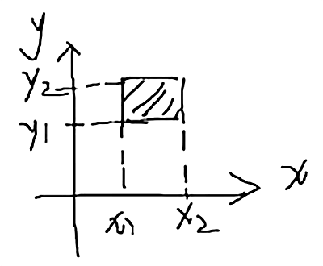
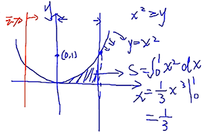
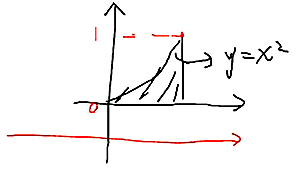

# 第三章例题

## 例题 1

二维 r.v. `(X,Y)` 的分布函数为 `F(x,y)`，则 `F(+∞,+∞) = ?`

全覆盖面，等于 1

## 例题 2

二维 r.v. `(X,Y)` 的分布函数为 `F(x,y)`，则 `P{X ≤ 0, Y ≤ 0}` 表示为？

F(0, 0)

## 例题 3

已知二维 r.v. `(X,Y)` 的分布函数 `F(x,y)`，求 `P{x₁ < X ≤ x₂, y₁ < Y ≤ y₂}`



```
F(x₂y₂) - F(x₁y₂) - F(x₂y₁) + F(x₁y₁)
```

## 例题 4

根据二维 r.v. 分布律

| X\Y | 0 | 1 | 2 |
| :--: | :--: | :--: | :--: |
| 1 | 0.1 | 0.2 | 0.25 |
| 2 | 0 | 0.15 | A |

1. `A` 值 = 1 - 其它之和 = 0.3
2. `P{X = Y}` = 0.2 + 0.3 = 0.5
3. `P{X + Y ≤ 2}` = 0.1 + 0.2 + 0 = 0.3
4. `P{X = 1}` = 0.1 + 0.2 + 0.25 = 0.55

5. 求 `X,Y` 的边缘分布

补全表格可得：

| X | 1 | 2 |
| :--: | :--: | :--: |
| P | 0.55 | 0.45 |

| Y | 0 | 1 | 2 |
| :--: | :--: | :--: | :--: |
| P | 0.1 | 0.35 | 0.55 |

## 例题 5

根据二维 r.v. `(X,Y)` 的概率密度，求 `P{0 ≤ X ≤ 1, 0 ≤ Y ≤ 1}`

```
f(x,y) = {
  1/4, -1 ≤ x ≤ 1, -1 ≤ y ≤ 1,
  0, 其它.
```

```
一个底面积为 2*2，高为 1/4 的正方体（体积 1）
现在缩小到原有 1/4
1 * 1/4 = 1/4
```

## 例题 6

设二维 r.v. `(X,Y)` 服从区域 `D: 1- ≤ x ≤ 2, 0 ≤ y ≤ 2` 上的均匀分布，则 `(X,Y)` 的概率密度函数 `f(x,y)`

1. S

```
S = 3 × 2 = 6
```

2. 密度函数表达式

```
f(x,y) = {
  1/6, -1 ≤ x ≤ 2, 0 ≤ y ≤ 2,
  0, 其它.
```

## 例题 7

设 `(X,Y)` 在矩形域 `D` 上服从均匀分布，其中 `D: x² ≥ y, 0 ≤ x ≤ 1, y ≥0`, 求 `(X,Y)` 的边缘概率密度 `fₓ(x),fᵧ(y)`

```
f(x,y) = {
  1/S, x ∈ D,
  0, 其它.

x² ≥ y
y = x²
```


```
f(x,y) = {
  3, x ∈ D,
  0, 其它.
```







## 例题 8

根据概率密度求边缘密度

```
f(x,y) = {
  4, -1/2 ≤ x ≤0, 0 ≤ y ≤ 2x + 1
  0, 其它.
```

```
0 ≤ y ≤ 2x + 1
y = 2x + 1
x = (y - 1)/2
```


## 例题 9

二维 r.v. `X,Y` 相互独立，且服从参数为 1 的泊松分布，求 `P{X = 1,Y = 2}`

```
= P{X = 1} · P{Y = 2}
= (1¹e⁻¹/1)(1²e⁻¹/2)
= e⁻¹ × e⁻¹ / 2
= e⁻²/2
```

## 例题 10

`X,Y` 相互独立，根据分布律求 `a,b`

| X\Y | 1 | 2 |
| :--: | :--: | :--: |
| 1 | 1/9 | a |
| 2 | 1/6 | 1/3 |
| 3 | 1/18 | b |

```
补全表格边缘
```

| X\Y | 1 | 2 | |
| :--: | :--: | :--: | :--: |
| 1 | 1/9 | a | 1/9 + a |
| 2 | 1/6 | 1/3 | |
| 3 | 1/18 | b | 1/18 + b |
| | 1/3 | | |

```
因为独立，则有 P{X = 1, Y = 1} = P{X = 1}·P{Y = 1}
1/9 = (1/9 + a)(1/3)
a = 1/9

1/18 = (1/18 + b)(1/3)
// 或
b = 1 - 其它之和
```

## 例题 11

r.v. `X,Y` 独立同分布，`X` 的分布律如下，求 `P{X = Y}`

| X | 0 | 1 |
| :--: | :--: | :--: |
| P | 0.4 | 0.6 |

```
同分布：取值、概率相同
```

| Y | 0 | 1 |
| :--: | :--: | :--: |
| P | 0.4 | 0.6 |

```
P{X = Y}
= P{X = 0}·P{Y = 0} + P{X = 1}·P{Y = 1}
= 0.4² + 0.6²
= 0.52
```

## 例题 12

根据一下联合概率分布求 `F(0,1)`

| X\Y | 0 | 1 | 2 |
| :--: | :--: | :--: | :--: |
| -1 | 0.2 | 0.1 | 0.1 |
| 0 | 0 | 0.3 | 0 |
| 2 | 0.1 | 0 | 0.2 |

```
F(0,1)
= P{X ≤ 0, Y ≤ 1}
= P{X ≤ 0}·P{Y ≤ 1}
= 0.2 + 0.1 + 0 + 0.3
= 0.6
```

## 例题 13

二维离散 r.v. 函数分布

| X\Y | 0 | 1 | 2 |
| :--: | :--: | :--: | :--: |
| 0 | 1/4 | 1/6 | 1/8 |
| 1 | 1/4 | 1/8 | 1/12 |

求 `Z = X + Y` 分布律

```
X = 0, 1
Y = 0, 1, 2
Z = 0, 1, 2, 3

P{Z = 0} = P{X + Y = 0} = P{X = 0, Y = 0} = 1/4
P{Z = 1} = P{X + Y = 1} = P{X = 1, Y = 0} + P{X = 0, Y = 1} = 5/12
P{Z = 2} = P{X + Y = 2} = P{X = 0, Y = 2} + P{X = 1, Y = 1} = 1/4
P{Z = 3} = P{X + Y = 3} = P{X = 1, Y = 2} = 1/12
```

得

| Z | 0 | 1 | 2 | 3 |
| :--: | :--: | :--: | :--: | :--: |
| P | 1/4 | 5/12 | 1/4 | 1/12 |

## 例题 14

设 `X` 与 `Y` 为互相独立的 r.v.，`X` 在 `[-1, 1]` 上服从均匀分布，`Y` 服从参数 `λ = 2` 的指数分布

1. 求 `(X,Y)` 的概率密度

根据均匀分布、指数分布公式得：

```
X~fₓ(x) = {
  1/2, -1 ≤ x ≤ 1,
  0, 其它

Y~fᵧ(y) = {
  2e⁻²ʸ, y ≥ 0,
  0, 其它
```

因为相互独立，所以

```
f(x,y)
= fₓ(x)·fᵧ(y)
= {
  1/2 · 2e⁻²ʸ = e⁻²ʸ, -1 ≤ x ≤ 1, y ≥ 0,
  0, 其它
```

2. 求 `P{X ≤ 1, Y ≤ 2}`

因为相互独立，所以


